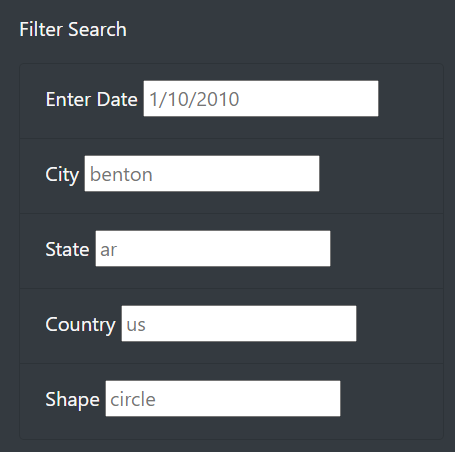
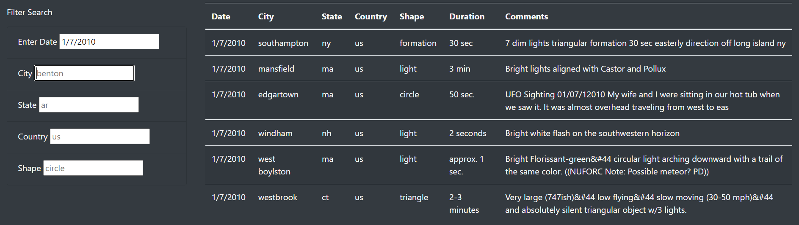
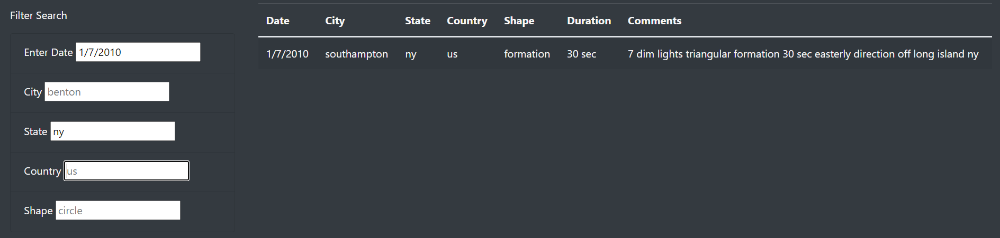

# UFO Sightings

## Overview of the analysis:

The purpose is well defined (2 pt)

The purpose of this project, is to build a website offering people a database to search UFO for sightings in different areas in the U.S. and Canada. Search criteria for the sightings include:
- Date 
- City
- State
- Country
- Shape 

Here is a visualization of the search criteria on the website: 

To search for a UFO sightings, simply enter the appropriate information in the search criteria field. Information can be added to one field alone, or to mulitple to narrow the results. Please note the different formats required for each field:
- Enter Date: MM/DD/YYYY
- City: lowercase
- State: 2 lowercase letters, denoting state
- Country: 2 lowercase letters, denoting country (note: us or ca only) 
- Shape: lowercase

#### Example: 
1. Without any search criteria filled in, the entire database is listed. This can be narrowed down by including information. 
2. Adding a field, for example 'Enter Date' will narrow the search results automatically.

3. The results can further be filtered by adding more search criterias, in this the 'State' was also updated. 

## Summary:

### Drawback 
The website was built to inform alien enthusiasts of UFO sightings. One of the drawbacks of this website, however, is that the search criteria needs to be exact to have results showing. It also does not notify you of when the format of the search criteria is not correct.

### Recommendations
To make the website more interactive, I would recommend to have a form, where alien enthusiasts can submit their own UFO sightings. 
I would also recommend to adjust the database to make it more visually appealing. Furthermore, I would outline the required format for the search criteria, so that users have the right tools to look up entries in the database. On top of that, I would update the field which has the incorrect format or information so that the users know what needs to be updated to receive a results. 
